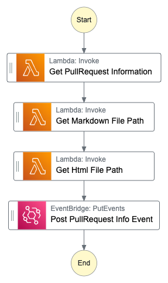
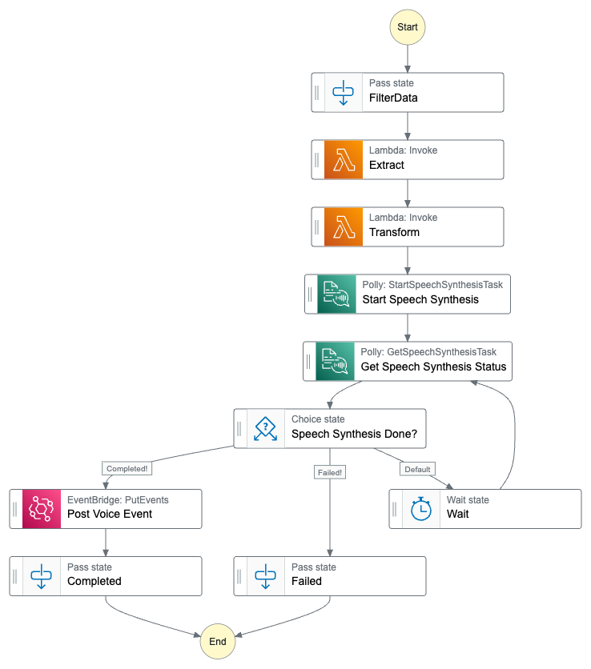
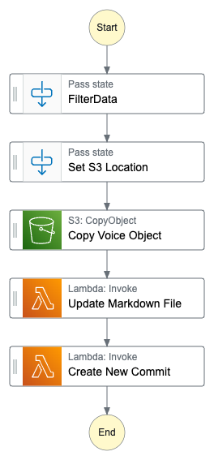

# Create voice for your blog

This project is an automated pipeline for generating voice from a blog post. The pipeline works on static blogs generated from markdown, like 11ty. The markdown file is automatically updated with a new audio tag in the frontmatter section. The updated markdown files is added back to GitHub in the open Pull-request.

The actual voice mp3 file remain in the configured S3 bucket.

## How it works

The pipeline needs an open Pull-Request to work. Create a new GitHub action that will run when a Pull-Request is opened. Post an event with information to EventBridge event-bus that will start the entire flow.

Example of CLI command to post the needed information.

``` bash
aws events put-events --entries '[{"EventBusName": "<bus name>", "Source": "GithubActions","DetailType": "PullRequestOpen","Detail": "{\"pr_number\": \"${{github.event.number}}\"}"}]'
```

The pipeline consists of three separate StepFunctions, all with a specific job. Each StepFunction is invoked on events on an EventBridge event-bus and post back events when completed.


### Collect Information StepFunction



### Extract Transform StepFunction



### Update Pull-Request StepFunction




## Deployment

To deploy the solution use [SAM CLI](https://docs.aws.amazon.com/serverless-application-model/latest/developerguide/install-sam-cli.html)

Create samconfig.toml config files for all sub-projects to be used by SAM.

Example.

``` yaml
version=0.1
[default.deploy.parameters]
stack_name = "<stack name>"
s3_bucket = "<s3 bucket for sam>"
s3_prefix = "..."
region = "eu-west-1"
confirm_changeset = false
capabilities = "CAPABILITY_NAMED_IAM"
parameter_overrides = "Application=\".... \" EventBridgeName=\".... \" ....."
```

## Secrets

The pipeline require access to your GitHub repo. Add an access token, that the pipeline can use, to a SecretsManager secret. Add a key/value secret with 'github-token' as the key and the access token as value.

Specify the name of the SecretsManager secret in the SAM template or samconfig.toml file.

